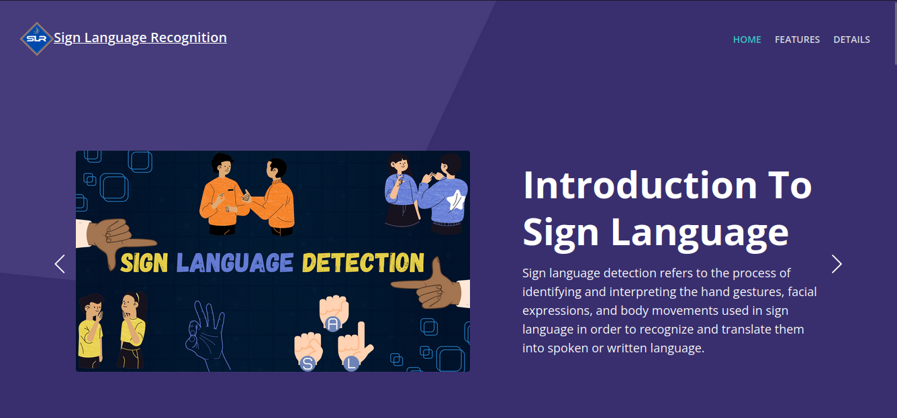
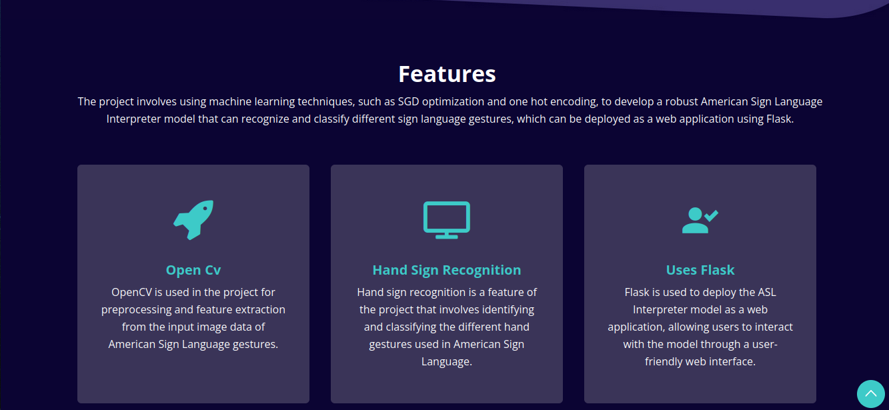
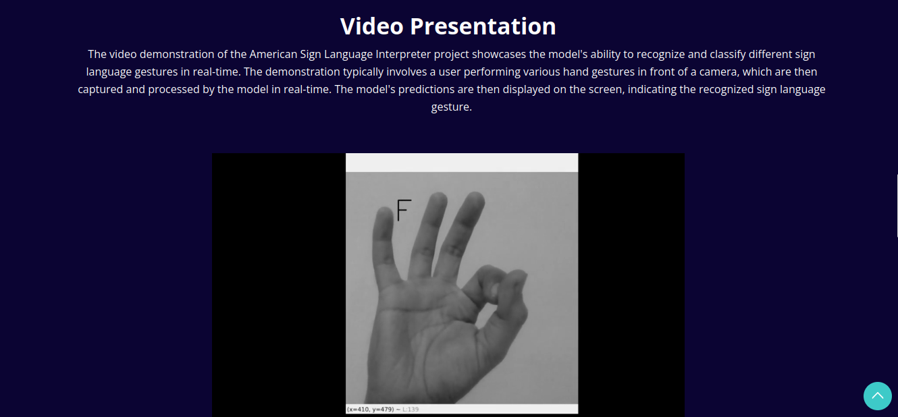
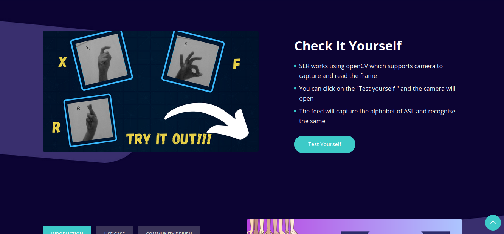
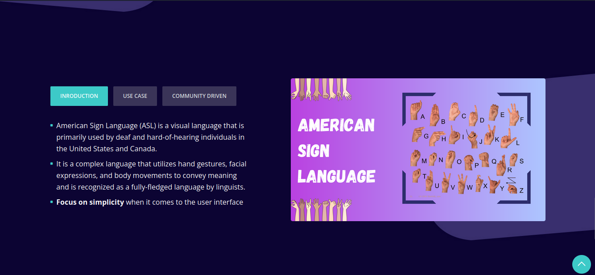

# Asl Sign Language Recognition using flask and opencv


This project aims to detect American Sign Language (ASL) hand gestures corresponding to the numbers 0-9 and the alphabets A-Z. It uses machine learning techniques to recognize hand gestures and translate them into text, providing an interactive experience with chatbot support for queries and troubleshooting.


### Screenshots







# Setup 

1. Install python

2. Install any virtual environment software of your choice
    
3. Clone this repository and cd into the project directory and activate the virtual environment.

4. Install dependency

    ```shell
   
    pip install -r requirement.txt

   ```

5. Run the application

   
    ```shell

    python app.py 

    ```


